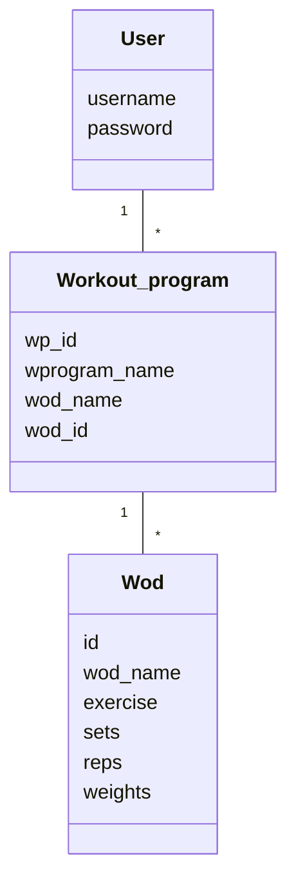

Ohjelma perustuu kerrosarkkitehtuurin seuraavan pakkauskaavion mukaisesti:

Sovelluksen loogisen tietomallin muodostavat luokat User, Wod ja Workout_program:

Toiminnallisista kokonaisuuksista vastaavat luokat user_service, wod_service ja wprogram_service. Näissä on rakennettu käyttöliittymän toiminnoille omat metodit, esim. 
- login(username, password)
- save_new_wod(entries)
- initialize_wp_view()

