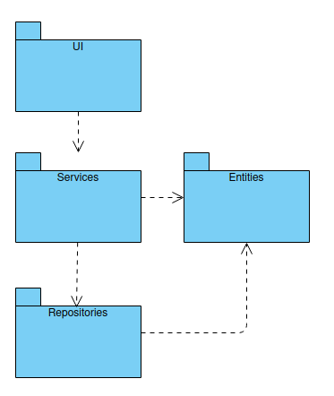
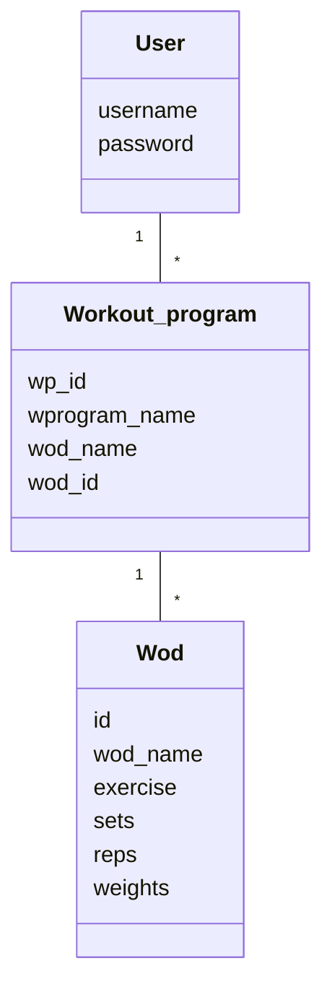
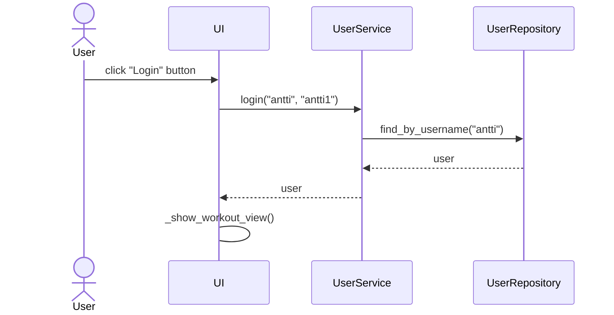

# Arkkitehtuuri

## Pakkauskaavio

Ohjelma perustuu kerrosarkkitehtuurin seuraavan pakkauskaavion mukaisesti:



Sovelluksen loogisen tietomallin muodostavat luokat User, Wod ja Workout_program:



Toiminnallisista kokonaisuuksista vastaavat luokat user_service, wod_service ja wprogram_service. Näissä on rakennettu käyttöliittymän toiminnoille omat metodit, esim. 
- login(username, password)
- save_new_wod(entries)
- initialize_wp_view()

## Sekvenssidiagrammit

Käyttäjä kirjautuu sisälle kuntosaliohjelmaansa:



Käyttäjä tallentaa kuntosaliohjelmaan uuden treenin:

```mermaid
sequenceDiagram
  actor Use
  participant UI
  participant WodService
  participant WodRepository
  participant UserService
  participant UserRepository
  participant WorkoutProgramRepository
  User->>UI: click "New WOD" button
  UI->>UI: _show_new_wod_view()
  User->>UI: Fill in workout name, exercise, sets, reps, weights
  User->>UI: click "Save" button
  UI->>WodService: save_new_wod(entries)
  WodService->>UserService: get_current_user()
  WodService->>WorkoutProgramRepository: find_wprogram_id_by_user("current_user")
  WodService-->>WodRepository: write(wod_name, wprogram_id, sets, reps, weights)
  UI->UI: _show_new_wod_view()
  ```